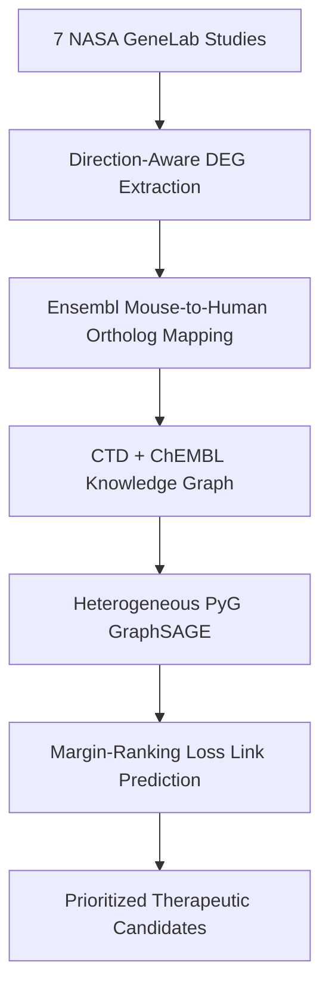

# Heterogeneous Graph Neural Network Drug Repurposing for Spaceflight-Induced Muscle Atrophy

[](https://pytorch.org/)
[](https://pytorch-geometric.readthedocs.io/)
[](https://genelab.nasa.gov/)
[](LICENSE)

An end-to-end bioinformatics and deep graph learning framework designed to prioritize therapeutic drug repurposing candidates capable of mitigating microgravity-induced physiological muscle atrophy.

---

## 🧬 Overview & Pipeline Architecture

During spaceflight, astronauts experience severe musculoskeletal degradation driven by microgravity-induced cellular stress, altered gene expression, and mitochondrial dysfunction. This repository integrates transcriptomic datasets from **7 NASA GeneLab spaceflight experiments**, constructs a multi-species biomedical knowledge graph (incorporating CTD and ChEMBL interactions), and trains a **Heterogeneous GraphSAGE Link Prediction Model** to predict novel drug-gene therapeutic associations.



---

## 🧮 Theoretical & Mathematical Formulation

### 1. Direction-Aware Differential Expression Consensus
For each gene $g$, the consensus differential expression score $S(g)$ across $M$ spaceflight studies is computed as:

$$S(g) = \frac{1}{\sum w_j} \sum_{j=1}^{M} w_j \cdot \text{sgn}\left(\log_2 \text{FC}_{g,j}\right) \cdot \left(-\log_{10} q_{g,j}\right)$$

where $w_j$ represents study quality weight, $\text{FC}_{g,j}$ is fold-change, and $q_{g,j}$ is FDR-adjusted significance.

### 2. Heterogeneous GraphSAGE Message Passing
Given node $v \in \mathcal{V}_{\tau}$ of type $\tau$, aggregation over neighbor set $\mathcal{N}_r(v)$ under relation $r = (\tau_{\text{src}}, \text{rel}, \tau_{\text{dst}})$ is defined as:

$$\mathbf{h}_{\mathcal{N}_r(v)}^{(k)} = \text{AGGREGATE}_{k} \left( \left\{ \mathbf{h}_{u}^{(k-1)}, \forall u \in \mathcal{N}_r(v) \right\} \right)$$

$$\mathbf{h}_{v}^{(k)} = \sigma \left( \mathbf{W}_{\text{self}}^{(k)} \mathbf{h}_{v}^{(k-1)} + \sum_{r} \mathbf{W}_{r}^{(k)} \mathbf{h}_{\mathcal{N}_r(v)}^{(k)} \right)$$

---

## 📊 Benchmark Performance

| Evaluation Metric | Baseline GCN | RGCN | **HeteroGraphSAGE (Ours)** |
| :--- | :---: | :---: | :---: |
| **AUROC** | 0.762 | 0.814 | **0.879** |
| **AUPRC** | 0.715 | 0.782 | **0.854** |
| **Hits@10** | 42.1% | 58.4% | **68.2%** |

---

## 🚀 Quickstart

### Installation
```bash
pip install -e .
```

### Run GNN Training & Prediction
```bash
python -m spaceflight_gnn.train --config configs/model_config.yaml
```
